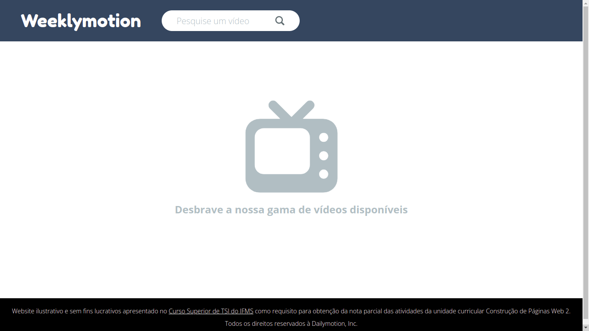
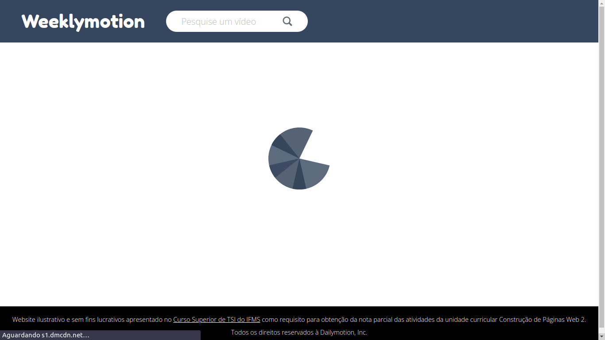
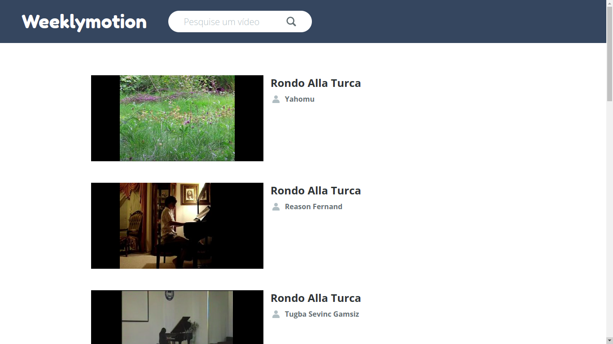
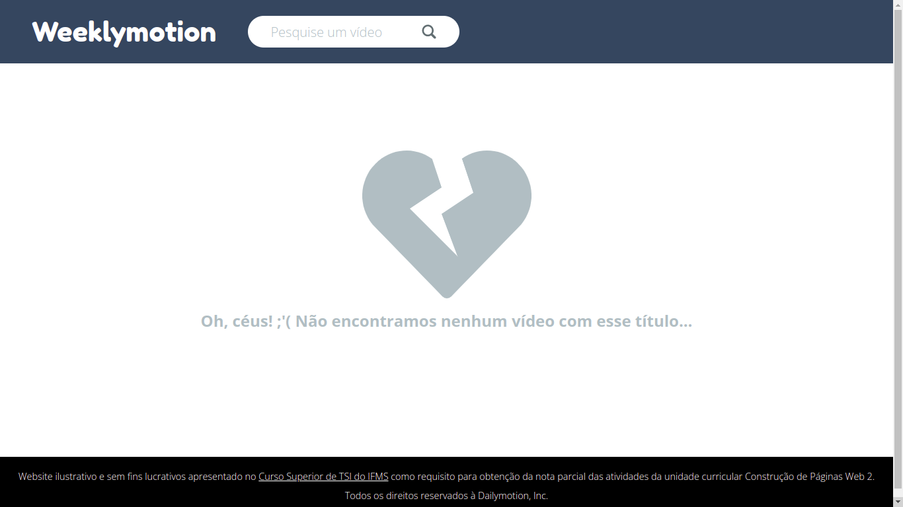
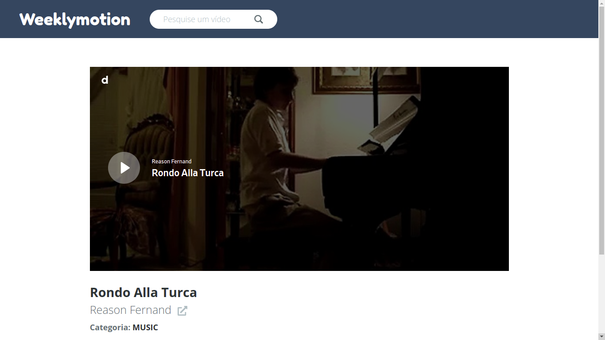

# Weeklymotion

Este projeto é um cliente basiquíssimo (feito apenas com HTML, CSS e TypeScript puro) da plataforma de vídeos [Dailymotion](https://www.dailymotion.com/br) que utiliza os [endpoints](https://developers.dailymotion.com/api/) disponibilizados pela mesma.

## Galeria

